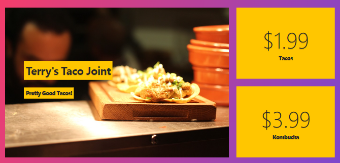
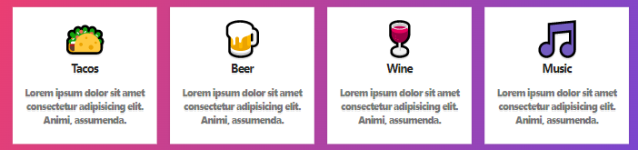
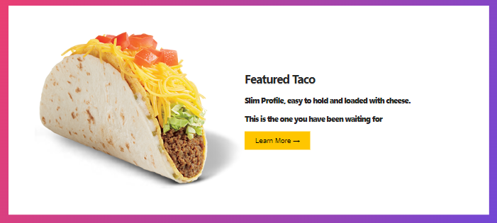
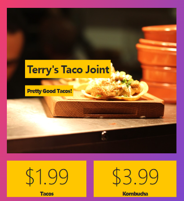
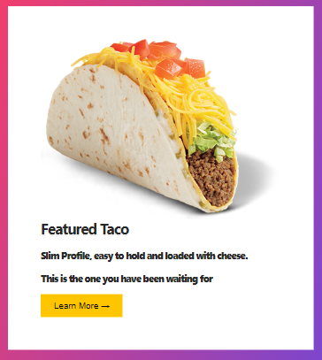
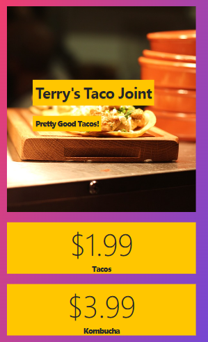

# CSS Responsive Taco

## Steps for the initial layout.

1. Top (grid-areas)

   

2. Menu (grid RAM)

   

3. Features (grid RAM)

   

4. About (grid with column of 400px and 1fr)

   

5. Gallery (grid RAM)

   

6. Gallery h2 (set grid columns to go across entire top row)

   ```css
   .gallery h2 {
   /* use grid columns to places insta grams across top of gallery */
   ```

## Adding Media Query at 700px

1. Top layout (grid areas)

   

2. About (grid only 1 column at 1fr )

   

## Adding media query at 500px.

1. Top layout (grid areas)

   
